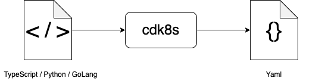
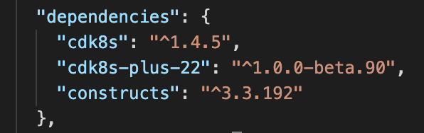

# CDK8S DEMO

## Introduction
- cdk8s is developed by AWS
- cdk8s are like library, which synthesizes your code into k8s manifests



- cdk8s cli is workflow tool
- cdk8s supports typescript, python, golang

## Typescript
**This demo will use Typescript.**

### Overview

1. Run `npm install -g cdk8s-cli`  to **install its cli globally**.

2. Run `cdk8s init typescript-app` to **create a new typescript cdk8s project**.

   - You can see that in `package.json` and `node_modules/`, it already has cdk8s dependencies defined and installed.  `package.json` :

   

   - You can also see a `cdk8s.yaml` generated. And `app` represents what `cdk8s synth` command will run (i.e. in this case, `cdk8s synth` = `node main.js`). `cdk8s.yaml` :

   

3. **Start your code** in `main.ts`, then **compile it** to `main.js` with `npm run compile `. (This part will have more detail in next section.)
4. Run `cdk8s synth` to **synthesize your code into manifests.**
   - K8S manifests will be generated in `dist/` folder


### Code

- You can make use of  `npm run watch` command. It helps while you are coding, it will automatically compile your `.ts` to `.js` on every Save. 

- Frequently used  `class` is  `Chart`

  ```typescript
  // main.ts
  // for example like this
  // ...
  export class MyChart extends Chart {
    constructor(scope: Construct, id: string, props: ChartProps = { }) {
      super(scope, id, props);
      // define resources here
    }
  }
  // ...
  ```

- Easy to create deployment and expose as a service by simply compiling the ts file then run `cdk8s synth`

  ```typescript
  // main.ts
  // ...
  export class MyChart extends Chart {
    constructor(scope: Construct, id: string, props: ChartProps = { }) {
      super(scope, id, props);
      
      const deployment = new kplus.Deployment(this, "nginx", {
      	containers: [{imsage: "nginx"}],  
      }); // cdk8s will synthesize it into a 'Deployment' manifest
      
      deployment.expose(80); // cdk8s will synthesize it into 'Service' manifest
    }
  }
  // ...
  ```

- Easy to refactor code for deplicated actions such as deployments, services, so on.

- Use `Jest` to implement unit tests comparing synthesized result and Chart. This helps detect any expected and unexpected changes. (It is good to include this step in CI pipeline too)


### Integration of cdk8s with CI/CD

Imagine a Git repository with a single YAML file that contains a basic Kubernetes manifest (e.g. Deployment + Service). Flux will take care of applying this to your cluster. If you push more changes into this repository Flux will take care of keeping your cluster in the desired state.


- Git branch merge will trigger ci pipeline which eventually synthesize any changes in cdk8s/
- We could design each cluster to pulls from only which branch and which directory path

